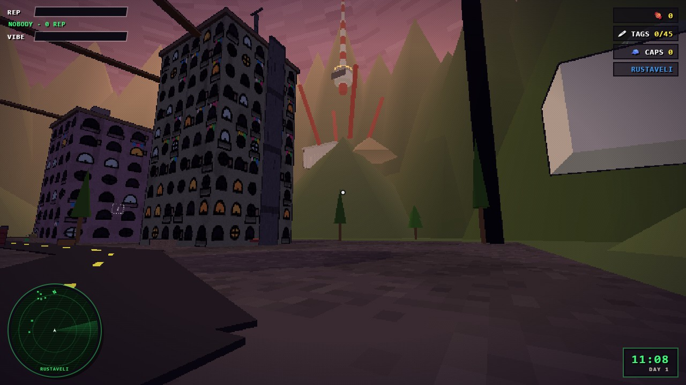

# TBS CANDY

A first-person Tbilisi rave-punk graffiti sandbox in the browser.



## Play

**Live:** https://batajini.github.io/tbs-candy/

Click **NEW GAME**, then click once to lock the mouse.

## Install

```bash
npm install
npm run dev
```

## Controls

| Key | Action |
| --- | --- |
| WASD | move |
| Mouse | look |
| Space | jump |
| Shift | sprint |
| C | crouch |
| E | talk / interact · **hold** to spray · enter/exit car |
| WASD (in car) | drive · Space = handbrake |
| F | camera |
| Tab | menu (map, tags, candy, people, settings) |

## Tech

Three.js + Vite. All art and audio are generated procedurally at runtime — no external assets.
